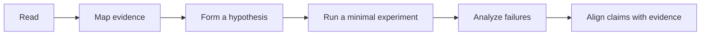

# Handbook

The Handbook contains stable methods, prompts, templates, and practice routines for AI-assisted robotics research. Use it to structure private work, then publish only material that passes the repository's public-safety checks.

For evolving public research questions and working judgments, visit the [Research OS](/research/).

## Recommended first-use path

1. Read the [Research Workflow](/docs/01-research-workflow) to understand the full research loop.
2. Fill the First Pass Research Worksheet in [Templates](/docs/04-templates).
3. Use the [Prompt Library](/docs/03-prompt-library) to extract assumptions and test a possible gap.
4. Practice with the [Research Drills](/docs/10-research-drills).
5. Check every public artifact against the [Sanitization Guide](/docs/05-sanitization).

## Research workflow

## Documentation map

| Area | Use it for | Key pages |
|---|---|---|
| Getting Started | Learn the end-to-end process and establish a working rhythm. | [Research Workflow](/docs/01-research-workflow), [Graduate Student Playbook](/docs/06-grad-student-playbook) |
| Research Foundations | Orient research questions and train research judgment. | [Robotics Frontiers](/docs/02-robotics-frontiers), [Research Taste](/docs/07-research-taste) |
| Practice and Workflows | Turn recurring research work into small evidence-producing loops. | [Research Drills](/docs/10-research-drills), [AI Value Playbook](/docs/08-ai-value-playbook), [Active Workflows](/docs/09-active-workflows) |
| Toolkit | Copy and adapt prompts, templates, and worked examples. | [Prompt Library](/docs/03-prompt-library), [Templates](/docs/04-templates), [Sanitized Examples](/examples/sanitized-examples) |
| Responsible Research | Prepare material for safe public release. | [Sanitization Guide](/docs/05-sanitization) |

::: warning Privacy boundary
The examples in this site are synthetic or anonymized. Keep raw chat logs, private research notes, unpublished results, credentials, private datasets, proprietary code, and identifying lab details outside this repository.
:::
