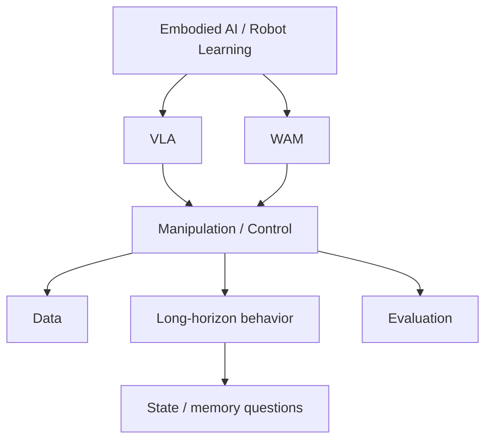

# Research OS

The Research OS is the evolving public research layer of AI for Robotics Research. It organizes research questions, public evidence, contradictions, working judgments, open questions, and falsifiable hypotheses as connected Research Threads.

The [Handbook](/handbook/) explains reusable research methods. The Research OS applies those methods to living public syntheses. A working judgment records the current interpretation within a stated scope; it is not presented as field consensus.

## Research map

### Active / Scoping

| Research thread | Status | Purpose in v0.1 |
|---|---|---|
| [Vision-Language-Action Models](/research/threads/vla) | Scoping | Define a public scope before human literature synthesis begins. |
| [World Action Models](/research/threads/world-action-models) | Scoping | Define a public scope before human literature synthesis begins. |

### Planned

- Long-Horizon Manipulation
- Embodied Data
- Evaluation

Planned topics do not have pages yet. A thread should be created only when a maintainer is ready to define its scope and review public sources.

Questions about persistent state, history, and memory can arise across VLA, WAM, and long-horizon manipulation. They remain cross-cutting research questions rather than a separate thread in v0.1.

## How working judgments are maintained

- Factual claims must link to public sources.
- Evidence receives stable IDs so judgments and contradictions can point back to it.
- Each thread records its status, review date, evidence cutoff, scope, and confidence.
- Confidence applies only to the stated scope and includes a written rationale.
- New evidence should update the judgment, confidence, open questions, and change log together.

Use the [Research Thread Template](/research/thread-template) when proposing a new synthesis.

## Public and private research

Public threads may contain research questions, public evidence, cautious interpretation, contradictions, and appropriately scoped falsifiable hypotheses. They must not contain unpublished results, private datasets, internal benchmarks, detailed private protocols, infrastructure details, confidential conversations, or submission-sensitive novelty.

Use the [Sanitization Guide](/docs/05-sanitization) before publishing or revising a thread. If a public hypothesis overlaps strongly with an unpublished submission, defer publication.

## Discussion

[GitHub Discussions](https://github.com/asandstar/ai-for-robotics-research/discussions) is the discussion layer for challenging judgments, suggesting public evidence, and discussing papers. Discussion comments are proposals, not verified evidence. Incorporate them into a Research Thread only after checking the source and reviewing the change in Markdown.
